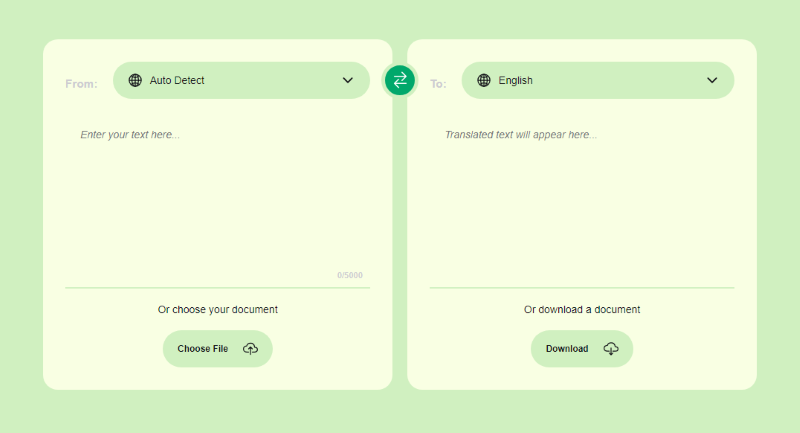

# Text Translator Application

#### What has been implemented:

- minimalistic, simple and familiar app design
- ability to switch light/dark theme using JS
- used free **Google Translate API** to recive the response from server
- ability to upload documents of various formats (ms office, pdf, txt) to the application using the **"Choose File""** button
- ability to download a document in txt format to the application using the **Download** button
- ability to swap language position between blocks of app
- a character counter for text input
- click here to try => [_**Text Translator App**_](https://bakna2t.github.io/translator/)

---

